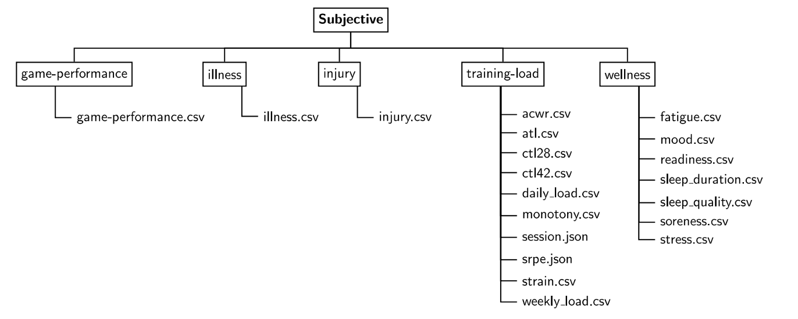
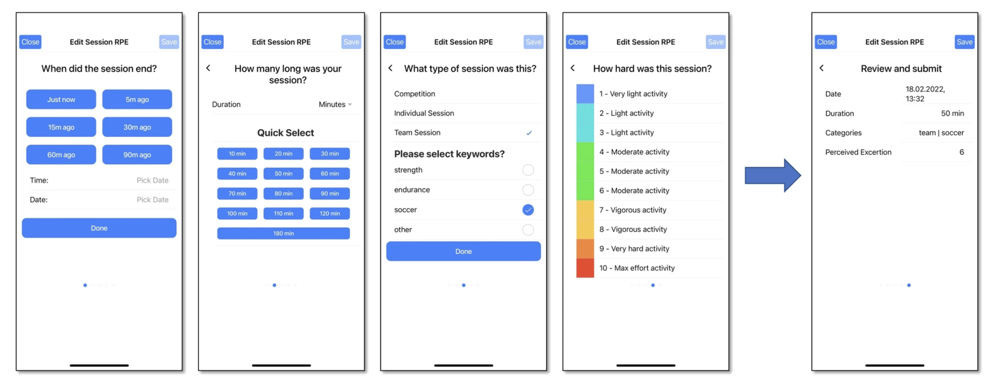

## Abstract

This paper conducts an explanatory analysis on an injury related dataset among female soccer players, using the *SoccerMon* dataset obtained from the paper [*A large-scale multivariate soccer athlete health, performance, and position monitoring dataset*](https://www.nature.com/articles/s41597-024-03386-x). This project investigates whether there are patterns in players' emotional and physical status, as well as training load, leading up to injury events. Additionally, it investigates differences in wellness status and training load between injured and non-injured players, as well as differences between teams. This study is motivated by the goal of identifying new factors that may help reduce the risk of future injuries among female soccer players. The results show that patterns in training load metrics may be observed prior to injury events, whereas such patterns are not evident in self reported wellness metrics alone.

## Introduction

Injuries among athletes are inevitable, considering the amount of training they undergo and the significant physical demands placed on their bodies, especially in high intensity anaerobic sports like soccer. Even though the demand for injury research remains high, sports data is often difficult to obtain due to legal restrictions and a lack of resources for data collection. It also requires a considerable amount of effort from athletes to share their data. The previous paper further emphasizes the need to investigate data from female soccer players, as the majority of the existing datasets focus on male soccer players. Additionally, injury data is scarce, as it shares similarities with mortality data in the sense that it cannot be directly controlled or experimentally induced. 

In this paper, injured players are defined as those who have had injury at least once over a two year period, while non-injured players are those who never experiences injuries during the same period. 

The paper investigates whether:

-   there are patterns in players' wellness status and training load leading up to injury events

Additional Questions: 

-   whether there are differences in wellness status and training load between injured and non-injured players

-   whether there are differences in wellness status and training load differences among injured players between two teams

-   whether there are differences in wellness status and training load differences among non-injured players between two teams

## Dataset Overviw 

The *SoccerMon* dataset is obtained from the paper *A large-scale multivariate soccer athlete health, performance, and position monitoring dataset*, published in Nature in 2024. It contains data from female soccer players in two professional Norwegian teams, and this paper refers to these teams as Team A and Team B. 

The *SoccerMon* dataset is a time series dataset collected from two main components from January 1st 2020 to December 31st 2021 according to the previous paper. 

1. Subjective report: collected by using PmSys athlete monitoring system, which logs parameters related to training load, wellness, injuries, illnesses, and game performance. 

2. Objective report: collected log parameters related to position, acceleration, rotaion, and heart rate by wearable GPS tracking equipment. 

In this paper, only subjective report is analyzed. Within the subjective report, injury, wellness, and training load datasets are selected. 

Below shows a representation of how a subjective report is originally organized and how PmSys looks like. 

<div style="text-align:center;">
  <br>
  <em>Figure 1: Overview of the system</em>
</div>

<br>

<div style="text-align:center;">
  <br>
  <em>Figure 2: PmSys interface</em>
</div>

### Data Components

**Injury Report**
<br>
The injury dataset (`injury.csv`, $(162 \times 13)$) records individual injury events at the player level. Each record contains:

- `player_name`: player names (tokenized)
- `type`: body region of the injury and severity of the injury classified as either *minor* or *major* 
- `timestamp`: date and time of injury occurrence

**Wellness Report**
<br>
The wellness report consists of daily self reported measures collected per player. Each file has a size $(731 \times 51)$, representing daily observations for all players for two years. 

<br>

| Report | Granularity | Parameter | Description |
|:----------------|:------------------|:----------------|:------------------|
| Injury Report | Per injury | Timestamp | Date and time for injury |
| Injury Report | Per injury | Location | Area of injury marked on body silhouette |
| Injury Report | Per injury | Severity | Severity of injury indicated as either minor or major |
| Wellness Report | Per day | Timestamp | Date for which the report applies |
| Wellness Report | Per day | Fatigue | Fatigue (1–5) |
| Wellness Report | Per day | Mood | Mood (1–5) |
| Wellness Report | Per day | Readiness | Readiness to train (1–10) |
| Wellness Report | Per day | Sleep duration | Sleep duration for the previous night in hours |
| Wellness Report | Per day | Sleep quality | Sleep quality for the previous night (1–5) |
| Wellness Report | Per day | Soreness | Muscle soreness (1–5) |
| Wellness Report | Per day | Stress | Stress (1–10) |

<br>

**Training Load Report** 
<br>
The training load report contains derived workload metrics computed from session based ratings of perceived exertion (sRPE) metric. This metric represents how how the player felt the training was on a scale of 1-10. Each file has a size $(731 \times 51)$, representing daily observations for all players for two years.

Files include: 

-   `acwr.csv` 

-   `atl.csv` 

-   `ctl28.csv` 

-   `ctl42.csv` 

-   `daily_load.csv` 

-   `monotony.csv` 

-   `strain.csv`

-   `weekly_load.csv`

<br>

| Metric | Description | Formula |
|:-------------------|:------------------------------|:---------------------|
| Session RPE (sRPE) | The workload for a single session based on the session duration and the reported RPE | $RPE \cdot duration$ |
| (Daily) Training Load | The sum of sRPE for a day | $\sum sRPE$ per day |
| Weekly Load (WL) | The sum of sRPE over the last 7 days | $\sum sRPE$ per week |
| Acute Training Load (ATL) | The current level of fatigue (average sRPE over the last 7 days) | $7^{-1} \sum_{n=i}^{i+7} DL_i$ |
| Chronic Training Load (CTL) | The cumulative training dose that builds up over a longer period of time (average sRPE over the last 28 or 42 days) | $x^{-1} \sum_{n=i}^{i+x} DL_i,\ x = 28\ \text{or}\ 42$ |
| Acute Chronic Workload Ratio (ACWR) | An indication of whether an athlete is in a well-prepared state, or at an increased risk of getting injured (ATL divided by CTL) | $ATL \cdot CTL^{-1}$ |
| Monotony | Training variation across the last 7 days (average sRPE over the last 7 days divided by the standard deviation (SD)) | $ATL \cdot SD^{-1}$ |
| Strain | Overall training stress from the last 7 days (total weekly sRPE multiplied with Monotony) | $WL \cdot Monotony$ |

```{r, include = FALSE}
library(dplyr)
library(lubridate)
library(knitr)
library(tidyr)
library(jsonlite)
library(readr)
library(stringr)
library(plotly)
library(htmlwidgets)
library(kableExtra)
library(purrr)
```

```{r, include = FALSE}
# Injury Data 
injury <- read.csv("/Users/kyokaono/Desktop/injuryanalysis/subjective/injury/injury.csv")
dim(injury)
```

<br><br>

<div style="font-weight:bold; text-align:center; margin-bottom:-10px;">
Table 1: Head of Injury Dataset
</div>
```{r, echo = FALSE}
kable(head(injury))
```

<br><br>

<div style="font-weight:bold; text-align:center; margin-bottom:-10px;">
Table 2: Tail of Injury Dataset
</div>
```{r, echo = FALSE}
kable(tail(as_tibble(injury)))
```

```{r, include = FALSE}
fatigue <- read.csv("/Users/kyokaono/Desktop/injuryanalysis/subjective/wellness/fatigue.csv")
```

<br><br>

<div style="font-weight:bold; text-align:center; margin-bottom:-10px;">
Table 3: Head of Fatigue Dataset
</div>
```{r, echo = FALSE}
kable(head(fatigue))
```

<br><br>

<div style="font-weight:bold; text-align:center; margin-bottom:-10px;">
Table 4: Tail of Fatigue Dataset
</div>
```{r, echo = FALSE}
kable(tail(as_tibble(fatigue)))
```

```{r, include = FALSE}
mood <- read.csv("/Users/kyokaono/Desktop/injuryanalysis/subjective/wellness/mood.csv")
```

<br><br>

<div style="font-weight:bold; text-align:center; margin-bottom:-10px;">
Table 5: Head of Mood Dataset
</div>
```{r, echo = FALSE}
kable(head(mood))
```

<br><br>

<div style="font-weight:bold; text-align:center; margin-bottom:-10px;">
Table 6: Tail of Mood Dataset
</div>
```{r, echo = FALSE}
kable(tail(as_tibble(mood)))
```

```{r, include = FALSE}
readiness <- read.csv("/Users/kyokaono/Desktop/injuryanalysis/subjective/wellness/readiness.csv")
```

<br><br>

<div style="font-weight:bold; text-align:center; margin-bottom:-10px;">
Table 7: Head of Readiness Dataset
</div>
```{r, echo = FALSE}
kable(head(readiness))
```

<br><br>

<div style="font-weight:bold; text-align:center; margin-bottom:-10px;">
Table 8: Tail of Readiness Dataset
</div>
```{r, echo = FALSE}
kable(tail(as_tibble(readiness)))
```

```{r, include = FALSE}
stress <- read.csv("/Users/kyokaono/Desktop/injuryanalysis/subjective/wellness/stress.csv")
```

<br><br>

<div style="font-weight:bold; text-align:center; margin-bottom:-10px;">
Table 9: Head of Stress Dataset
</div>
```{r, echo = FALSE}
kable(head(stress))
```

<br><br>

<div style="font-weight:bold; text-align:center; margin-bottom:-10px;">
Table 10: Tail of Stress Dataset
</div>
```{r, echo = FALSE}
kable(tail(as_tibble(stress)))
```

```{r, include = FALSE}
sleep_duration <- read.csv("/Users/kyokaono/Desktop/injuryanalysis/subjective/wellness/sleep_duration.csv")
```

<br><br>

<div style="font-weight:bold; text-align:center; margin-bottom:-10px;">
Table 11: Head of Sleep Duration Dataset
</div>
```{r, echo = FALSE}
kable(head(sleep_duration))
```

<br><br>

<div style="font-weight:bold; text-align:center; margin-bottom:-10px;">
Table 12: Tail of Sleep Duration Dataset
</div>
```{r, echo = FALSE}
kable(tail(as_tibble(sleep_duration)))
```

```{r, include = FALSE}
sleep_quality <- read.csv("/Users/kyokaono/Desktop/injuryanalysis/subjective/wellness/sleep_quality.csv")
```

<br><br>

<div style="font-weight:bold; text-align:center; margin-bottom:-10px;">
Table 13: Head of Sleep Quality Dataset
</div>
```{r, echo = FALSE}
kable(head(sleep_quality))
```

<br><br>

<div style="font-weight:bold; text-align:center; margin-bottom:-10px;">
Table 14: Tail of Sleep Quality Dataset
</div>
```{r, echo = FALSE}
kable(tail(as_tibble(sleep_quality)))
```

```{r, include = FALSE}
soreness <- read.csv("/Users/kyokaono/Desktop/injuryanalysis/subjective/wellness/soreness.csv")
```

<br><br>

<div style="font-weight:bold; text-align:center; margin-bottom:-10px;">
Table 15: Head of Soreness Dataset
</div>
```{r, echo = FALSE}
kable(head(soreness))
```

<br><br>

<div style="font-weight:bold; text-align:center; margin-bottom:-10px;">
Table 16: Tail of Soreness Dataset
</div>
```{r, echo = FALSE}
kable(tail(as_tibble(soreness)))
```

```{r, include = FALSE}
daily_load <- read.csv("/Users/kyokaono/Desktop/injuryanalysis/subjective/training-load/daily_load.csv")
```

<br><br>

<div style="font-weight:bold; text-align:center; margin-bottom:-10px;">
Table 17: Head of Daily Load Dataset
</div>
```{r, echo = FALSE}
kable(head(daily_load))
```

<br><br>

<div style="font-weight:bold; text-align:center; margin-bottom:-10px;">
Table 18: Tail of Daily Load Dataset
</div>
```{r, echo = FALSE}
kable(tail(as_tibble(daily_load)))
```

```{r, include = FALSE}
weekly_load <- read.csv("/Users/kyokaono/Desktop/injuryanalysis/subjective/training-load/weekly_load.csv")
```

<br><br>

<div style="font-weight:bold; text-align:center; margin-bottom:-10px;">
Table 19: Head of Weekly Load Dataset
</div>
```{r, echo = FALSE}
kable(head(weekly_load))
```

<br><br>

<div style="font-weight:bold; text-align:center; margin-bottom:-10px;">
Table 20: Tail of Weekly Load Dataset
</div>
```{r, echo = FALSE}
kable(tail(as_tibble(weekly_load)))
```

```{r, include = FALSE}
atl <- read.csv("/Users/kyokaono/Desktop/injuryanalysis/subjective/training-load/atl.csv")
```

<br><br>

<div style="font-weight:bold; text-align:center; margin-bottom:-10px;">
Table 21: Head of Acute Training Load (ATL) Load Dataset
</div>
```{r, echo = FALSE}
kable(head(atl))
```

<br><br>

<div style="font-weight:bold; text-align:center; margin-bottom:-10px;">
Table 22: Tail of Acute Training Load (ATL) Load Dataset
</div>
```{r, echo = FALSE}
kable(tail(as_tibble(atl)))
```

```{r, include = FALSE}
ctl28 <- read.csv("/Users/kyokaono/Desktop/injuryanalysis/subjective/training-load/ctl28.csv")
ctl42 <- read.csv("/Users/kyokaono/Desktop/injuryanalysis/subjective/training-load/ctl42.csv")
```

<br><br>

<div style="font-weight:bold; text-align:center; margin-bottom:-10px;">
Table 23: Head of Chronic Training Load (CTL) Dataset (28 Days)
</div>
```{r, echo = FALSE}
kable(head(ctl28))
```

<br><br>

<div style="font-weight:bold; text-align:center; margin-bottom:-10px;">
Table 24: Tail of Chronic Training Load (CTL) Dataset (28 Days)
</div>
```{r, echo = FALSE}
kable(tail(as_tibble(ctl28)))
```

<br><br>

<div style="font-weight:bold; text-align:center; margin-bottom:-10px;">
Table 25: Head of Chronic Training Load (CTL) Dataset (42 Days)
</div>
```{r, echo = FALSE}
kable(head(ctl42))
```

<br><br>

<div style="font-weight:bold; text-align:center; margin-bottom:-10px;">
Table 26: Tail of Chronic Training Load (CTL) Dataset (42 Days)
</div>
```{r, echo = FALSE}
kable(tail(as_tibble(ctl42)))
```

```{r, include = FALSE}
acwr <- read.csv("/Users/kyokaono/Desktop/injuryanalysis/subjective/training-load/acwr.csv")
```

<br><br>

<div style="font-weight:bold; text-align:center; margin-bottom:-10px;">
Table 27: Head of Acute Chronic Workload Ratio (ACWR) Dataset
</div>
```{r, echo = FALSE}
kable(head(acwr))
```

<br><br>

<div style="font-weight:bold; text-align:center; margin-bottom:-10px;">
Table 28: Tail of Acute Chronic Workload Ratio (ACWR) Dataset
</div>
```{r, echo = FALSE}
kable(tail(as_tibble(acwr)))
```

```{r, include = FALSE}
monotony <- read.csv("/Users/kyokaono/Desktop/injuryanalysis/subjective/training-load/monotony.csv")
```

<br><br>

<div style="font-weight:bold; text-align:center; margin-bottom:-10px;">
Table 29: Head of Monotony Dataset
</div>
```{r, echo = FALSE}
kable(head(monotony))
```

<br><br>

<div style="font-weight:bold; text-align:center; margin-bottom:-10px;">
Table 30: Tail of Monotony Dataset
</div>
```{r, echo = FALSE}
kable(tail(as_tibble(monotony)))
```

```{r, include = FALSE}
strain <- read.csv("/Users/kyokaono/Desktop/injuryanalysis/subjective/training-load/strain.csv")
```

<br><br>

<div style="font-weight:bold; text-align:center; margin-bottom:-10px;">
Table 31: Head of Strain Dataset
</div>
```{r, echo = FALSE}
kable(head(strain))
```

<br><br>

<div style="font-weight:bold; text-align:center; margin-bottom:-10px;">
Table 32: Tail of Strain Dataset
</div>
```{r, echo = FALSE}
kable(tail(as_tibble(strain)))
```

```{r, include = FALSE}
# checking dimensions of each dataset
dim(injury)
dim(fatigue)
dim(mood)
dim(readiness)
dim(stress)
dim(sleep_duration)
dim(sleep_quality)
dim(soreness)
dim(daily_load)
dim(weekly_load)
dim(atl)
dim(ctl28)
dim(ctl42)
dim(acwr)
dim(monotony)
dim(strain)
```

```{r, include = FALSE}
# check whether a single player recorded multiple injuries on different days 
sum(duplicated(injury$player_name))
length(unique(injury$player_name)) 
```

```{r, include = FALSE}
injury$player_name <- gsub("-", ".", injury$player_name) # change to . from -
injury$timestamp <- dmy(injury$timestamp)

injury <- injury %>%
  rename(player_id = player_name) %>%
  rename(date = timestamp) %>%
  mutate(injury_status = 1L,
         
         num_injury = str_count(type, "minor|major"),
         
         severity_max = ifelse(str_detect(type, "major"), "major", "minor"),
         
         groin_hip_injury = as.integer(str_detect(type, "groin_hip")),
         head_neck_injury = as.integer(str_detect(type, "head_neck")),
         left_foot_injury = as.integer(str_detect(type, "left_foot")),
         left_knee_injury = as.integer(str_detect(type, "left_knee")),
         left_leg_injury = as.integer(str_detect(type, "left_leg")),
         left_thigh_injury = as.integer(str_detect(type, "left_thigh")),
         right_foot_injury = as.integer(str_detect(type, "right_foot")),
         right_knee_injury = as.integer(str_detect(type, "right_knee")),
         right_leg_injury = as.integer(str_detect(type, "right_leg")),
         right_thigh_injury = as.integer(str_detect(type, "right_thigh")),
         stomach_back_injury = as.integer(str_detect(type, "stomach_back"))
         ) %>%
  select(-type)
```

```{r, include = FALSE}
data_list <- list(
  fatigue = fatigue,
  mood = mood,
  readiness = readiness,
  stress = stress,
  sleep_duration = sleep_duration,
  sleep_quality = sleep_quality,
  soreness = soreness,
  daily_load = daily_load,
  weekly_load = weekly_load,
  atl = atl,
  ctl28 = ctl28,
  ctl42 = ctl42,
  acwr = acwr,
  monotony = monotony,
  strain = strain
)
```

```{r, include = FALSE}
# checking data types to see if they can be merged 
for (name in names(data_list)) {
  cat("\n====================\n")
  cat("Dataset:", name, "\n")
  cat("====================\n")
  
  str(data_list[[name]])
}
```

### Final Dataset Structure 

The final dataset $(36556 \times 32)$ consists of a player-day structure containing the following groups of variables:

- `player_id`, `date`, `team`

- wellness variables: `fatigue`, `mood`, `readiness`, `sleep`, `soreness`, `stress`

- training load metrics: `daily_load`, `weekly_load`, `atl`, `ctl28`, `ctl42`, `acwr`,  `monotony`, `strain`

- injury metrics: `injury_status`, `num_injury`, `severity_max`, injury location indicators

```{r, include = FALSE}
# making dataset into a longer format 
fatigue_long <- fatigue %>%
  pivot_longer(
    cols = -Fatigue.Data,
    names_to = "player_id",
    values_to = "fatigue"
  )

mood_long <- mood %>%
  pivot_longer(
    cols = -Mood.Data,
    names_to = "player_id",
    values_to = "mood"
  )

readiness_long  <- readiness %>%
  pivot_longer(
    cols = -Readiness.Data,
    names_to = "player_id",
    values_to = "readiness"
  )

stress_long  <- stress %>%
  pivot_longer(
    cols = -Date,
    names_to = "player_id",
    values_to = "stress"
  )

sleep_duration_long  <- sleep_duration %>%
  pivot_longer(
    cols = -SleepDurH.Data,
    names_to = "player_id",
    values_to = "sleep_duration"
  )

sleep_quality_long  <- sleep_quality %>%
  pivot_longer(
    cols = -SleepQuality.Data,
    names_to = "player_id",
    values_to = "sleep_quality"
  )

soreness_long  <- soreness %>%
  pivot_longer(
    cols = -Soreness.Data,
    names_to = "player_id",
    values_to = "soreness"
  )

daily_load_long  <- daily_load %>%
  pivot_longer(
    cols = -Date,
    names_to = "player_id",
    values_to = "daily_load"
  )

weekly_load_long  <- weekly_load %>%
  pivot_longer(
    cols = -Date,
    names_to = "player_id",
    values_to = "weekly_load"
  )

atl_long  <- atl %>%
  pivot_longer(
    cols = -Date,
    names_to = "player_id",
    values_to = "atl"
  )

ctl28_long  <- ctl28 %>%
  pivot_longer(
    cols = -Date,
    names_to = "player_id",
    values_to = "ctl28"
  )

ctl42_long  <- ctl42 %>%
  pivot_longer(
    cols = -Date,
    names_to = "player_id",
    values_to = "ctl42"
  )

acwr_long  <- acwr %>%
  pivot_longer(
    cols = -Date,
    names_to = "player_id",
    values_to = "acwr"
  )

monotony_long  <- monotony %>%
  pivot_longer(
    cols = -Date,
    names_to = "player_id",
    values_to = "monotony"
  )

strain_long <- strain %>%
  pivot_longer(
    cols = -Date,
    names_to = "player_id",
    values_to = "strain"
  )

# checking that long format all contain the same num of rows and cols
dim(fatigue_long)
dim(mood_long)
dim(stress_long)
dim(readiness_long)
dim(sleep_duration_long)
dim(sleep_quality_long)
dim(soreness_long)
dim(daily_load_long)
dim(weekly_load_long) 
dim(atl_long)
dim(ctl28_long)
dim(ctl42_long)
dim(acwr_long)
dim(monotony_long)
dim(strain_long)
```

```{r, include = FALSE}
# Changed date variables to date objects and change the column name to date

fatigue_long$Fatigue.Data <- dmy(fatigue_long$Fatigue.Data)
fatigue_long <- fatigue_long %>% rename(date = Fatigue.Data)

mood_long$Mood.Data <- dmy(mood_long$Mood.Data)
mood_long <- mood_long %>% rename(date = Mood.Data)

readiness_long$Readiness.Data <- dmy(readiness_long$Readiness.Data)
readiness_long <- readiness_long %>% rename(date = Readiness.Data)

stress_long$Date <- dmy(stress_long$Date)
stress_long <- stress_long %>% rename(date = Date)

sleep_duration_long$SleepDurH.Data <- dmy(sleep_duration_long$SleepDurH.Data)
sleep_duration_long <- sleep_duration_long %>% rename(date = SleepDurH.Data)

sleep_quality_long$SleepQuality.Data <- dmy(sleep_quality_long$SleepQuality.Data)
sleep_quality_long <- sleep_quality_long %>% rename(date = SleepQuality.Data)

soreness_long$Soreness.Data <- dmy(soreness_long$Soreness.Data)
soreness_long <- soreness_long %>% rename(date = Soreness.Data)

daily_load_long$Date <- dmy(daily_load_long$Date)
daily_load_long <- daily_load_long %>% rename(date = Date)

weekly_load_long$Date <- dmy(weekly_load_long$Date)
weekly_load_long <- weekly_load_long %>% rename(date = Date)

atl_long$Date <- dmy(atl_long$Date)
atl_long <- atl_long %>% rename(date = Date)

ctl28_long$Date <- dmy(ctl28_long$Date)
ctl28_long <- ctl28_long %>% rename(date = Date)

ctl42_long$Date <- dmy(ctl42_long$Date)
ctl42_long <- ctl42_long %>% rename(date = Date)

acwr_long$Date <- dmy(acwr_long$Date)
acwr_long <- acwr_long %>% rename(date = Date)

monotony_long$Date <- dmy(monotony_long$Date)
monotony_long <- monotony_long %>% rename(date = Date)

strain_long$Date <- dmy(strain_long$Date)
strain_long <- strain_long %>% rename(date = Date)
```

```{r, include = FALSE}
# all datasets share the same player IDs
all_ids <- list(
  unique(fatigue_long$player_id),
  unique(mood_long$player_id),
  unique(stress_long$player_id),
  unique(readiness_long$player_id),
  unique(sleep_duration_long$player_id),
  unique(sleep_quality_long$player_id),
  unique(soreness_long$player_id),
  unique(daily_load_long$player_id),
  unique(weekly_load_long$player_id),
  unique(atl_long$player_id),
  unique(ctl28_long$player_id),
  unique(ctl42_long$player_id),
  unique(acwr_long$player_id),
  unique(monotony_long$player_id),
  unique(strain_long$player_id)
)

all(sapply(all_ids[-1], function(x) setequal(all_ids[[1]], x)))
```

```{r, include = FALSE}
datasets_long <- list(
  fatigue_long = fatigue_long,
  mood_long = mood_long,
  stress_long = stress_long,
  readiness_long = readiness_long,
  sleep_duration_long = sleep_duration_long,
  sleep_quality_long = sleep_quality_long,
  soreness_long = soreness_long,
  daily_load_long = daily_load_long,
  weekly_load_long = weekly_load_long,
  atl_long = atl_long,
  ctl28_long = ctl28_long,
  ctl42_long = ctl42_long,
  acwr_long = acwr_long,
  monotony_long = monotony_long,
  strain_long = strain_long
)
```

```{r, include = FALSE}
# no duplicated combination of player_id and date 
lapply(datasets_long, function(data) {
  sum(duplicated(data[c("player_id", "date")]))
})
```

```{r, include = FALSE}
# each player has the same number of data (days observed), and the same min and max days
lapply(names(datasets_long), function(name) {
  data <- datasets_long[[name]]

  data %>%
    group_by(player_id) %>%
    summarize(
      n_rows = n(),
      n_dates = n_distinct(date),
      min_date = min(date, na.rm = TRUE),
      max_date = max(date, na.rm = TRUE),
      .groups = "drop"
    ) %>%
    mutate(dataset = name)
})
```

```{r, include = FALSE}
# merge by date and player_id 
merged_long_data <- fatigue_long %>%
  inner_join(mood_long, by = c("date","player_id")) %>%
  inner_join(stress_long, by = c("date","player_id")) %>%
  inner_join(readiness_long, by = c("date","player_id")) %>%
  inner_join(sleep_duration_long, by = c("date","player_id")) %>%
  inner_join(sleep_quality_long, by = c("date","player_id")) %>%
  inner_join(soreness_long, by = c("date","player_id")) %>%
  inner_join(daily_load_long, by = c("date","player_id")) %>%
  inner_join(weekly_load_long, by = c("date","player_id")) %>%
  inner_join(atl_long, by = c("date","player_id")) %>%
  inner_join(ctl28_long, by = c("date","player_id")) %>%
  inner_join(ctl42_long, by = c("date","player_id")) %>%
  inner_join(acwr_long, by = c("date","player_id")) %>%
  inner_join(monotony_long, by = c("date","player_id")) %>%
  inner_join(strain_long, by = c("date", "player_id"))

dim(merged_long_data)
```

```{r, include = FALSE}
# merge this and the injury dataset
merged_long_data <- merged_long_data %>%
  mutate(team = str_extract(player_id, "^Team[AB]")) %>%
  left_join(injury, by = c("player_id", "date")) %>%
  mutate(injury_status = replace_na(injury_status, 0L),
         num_injury = replace_na(num_injury, 0L),
         severity_max = replace_na(severity_max, "none"),
         across(c(groin_hip_injury, 
                  head_neck_injury,
                  left_foot_injury,
                  left_knee_injury,
                  left_leg_injury,
                  left_thigh_injury,
                  right_foot_injury,
                  right_knee_injury,
                  right_leg_injury,
                  right_thigh_injury,
                  stomach_back_injury), ~replace_na(.x, 0L))) %>%
  relocate(team, .after = player_id)
```

```{r, include = FALSE}
# Ordered the player_id in alphabetical order, and mapped player_number 
player_map <- merged_long_data %>%
  distinct(player_id) %>%
  arrange(player_id) %>%
  mutate(player_label = paste0("player_", row_number()))

merged_long_data <- merged_long_data %>%
  left_join(player_map, by = "player_id") %>%
  mutate(player_id = player_label) %>%
  select(-player_label) %>%
  arrange(player_id, date)
```

<br><br>

<div style="font-weight:bold; text-align:center; margin-bottom:-10px;">
Table 33: Head of Final Dataset
</div>
```{r, echo = FALSE}
kable(head(merged_long_data))
```

<br><br>

<div style="font-weight:bold; text-align:center; margin-bottom:-10px;">
Table 34: Tail of Final Dataset
</div>
```{r, echo = FALSE}
kable(tail(as_tibble(merged_long_data)))
```

## Dataset Summary 

There are 15 injured players (some players had injuries multiple times over the course of two years), and 35 players who never experienced injury. In Team A, 11 players were injured and 16 players were never injured. In Team B, 4 players were injured and 19 players were never injured. 

| Team   | Injured Players | Non-Injured Players |
|:-------|:----------------|:----------------------|
| Team A | 11              | 16                    |
| Team B | 4               | 19                    |
| Total  | 15              | 35                    |

```{r, include = FALSE}
dim(merged_long_data)

injured_player_id <- unique(merged_long_data$player_id[which(merged_long_data$injury_status == 1)])

length(injured_player_id)

injured_player_data <- merged_long_data %>% 
  filter(player_id %in% injured_player_id)

dim(injured_player_data)

# sum(injured_player_data$injury_status == 1)

non_injured_player_data <- merged_long_data %>%
  filter(!player_id %in% injured_player_id)

length(unique(non_injured_player_data$player_id))

dim(non_injured_player_data)

# sum(non_injured_player_data$injury_status == 1)
```

<br><br>

<div style="font-weight:bold; text-align:center; margin-bottom:-10px;">
Table 35: Missing Data Ratio
</div>
```{r, echo = FALSE}
result <- map_dfr(names(merged_long_data), function(i) {
  x <- merged_long_data[[i]]
  
  tibble(
    Variable = i,
    `NA Count` = sum(is.na(x)),
    `NA Percentage (%)` = round(mean(is.na(x)) * 100, 2)
  )
})

kable(result)
```

## Methods

To compare differences in wellness status and training load between injured and non-injured players, the average values of all variables were calculated for each group. The same approach was also used to compare Team A and Team B. An interactive bar plot was created with `plotly` library for a visual comparison between two groups. Different variables can be selected using the dropdown menu for comparison.

To identify patterns in players' wellness status and training load leading up to the injury events, training load variables were analyzed separately from wellness and daily load variables when generating line plots. This reason is because wellness and daily load metrics were recorded per day, it made it difficult to visualize trends before and after the injury event. For the training load analysis, the `daily_load` variable was excluded and summarized over a two year period. 

Additionally, more than half of the wellness variables contained missing values, resulting in gaps in the time series plots. As it can be seen on the graph below, using the raw wellness data is not sufficiently informative to obtain a pattern relating to injuries. To improve interpretability, wellness and daily load variables were selected within a two months window before and after each player's first recorded injury. Additionally, rows which contained NA values were removed, except for rows where `injury_status` = 1. The injury event date is marked with a start symbol to allow for clearer visual comparison across time. If a variable is missing on the day of the injury, the star does not appear on the plot. Data from different players can be selected by clicking the legend, and different variables can be selected using the dropdown menu for comparison. 

```{r, include = FALSE}
wellness_vars <- c("fatigue", 
                  "mood", 
                  "stress", 
                  "readiness",
                  "sleep_duration", 
                  "sleep_quality", 
                  "soreness")

training_vars <- c("daily_load",
                  "weekly_load",
                  "atl",
                  "ctl28",
                  "ctl42",
                  "acwr",
                  "monotony",
                  "strain")
```

<br><br>

<div style="font-weight:bold; text-align:center; margin-bottom:-10px;">
Figure 3: Line plot of wellness and `daily_load` variables before date selection
</div>

```{r, echo = FALSE}
#| warning: false
injured_players_id <- unique(injured_player_data$player_id)

injury_dates_by_player <- injured_player_data %>%
  filter(injury_status == 1) %>%
  arrange(player_id, date)

p <- plot_ly()

for (ind_id in injured_players_id) {
  ind_data <- injured_player_data %>%
    filter(player_id == ind_id) %>%
    arrange(date)
  
  p <- p %>%
    add_trace(
      x           = ind_data$date,
      y           = ind_data[["fatigue"]],
      type        = "scatter",
      mode        = "lines",
      name        = ind_id,
      legendgroup = ind_id,       # links line + stars together
      line        = list(width = 2)
    )
}


for (ind_id in injured_players_id) {
  inj_data <- injury_dates_by_player %>%
    filter(player_id == ind_id)
  
  if (nrow(inj_data) > 0) {
    p <- p %>%
      add_trace(
        x           = inj_data$date,
        y           = inj_data[["fatigue"]],
        type        = "scatter",
        mode        = "markers",
        marker      = list(symbol = "star", size = 12, color = "gold"),
        name        = ind_id,
        legendgroup = ind_id,     # same group = toggles with the line
        showlegend  = FALSE       # no separate legend item for stars
      )
  }
}

buttons_4 <- lapply(wellness_vars, function(var) {
  
  line_y <- lapply(injured_players_id, function(ind_id) {
    injured_player_data %>%
      filter(player_id == ind_id) %>%
      arrange(date) %>%
      pull(var)
  })
  
  star_y <- lapply(injured_players_id, function(ind_id) {
    injury_dates_by_player %>%
      filter(player_id == ind_id) %>%
      pull(var)
  })
  
  list(
    method = "update",
    args = list(
      list(y = c(line_y, star_y)),   # lines first, then stars
      list(
        title = paste(gsub("_", " ", var), "- Injured Players"),
        yaxis = list(title = gsub("_", " ", var))
      )
    ),
    label = gsub("_", " ", var)
  )
})

p %>%
  layout(
    title  = paste(gsub("_", " ", "fatigue"), "- Injured Players"),
    xaxis  = list(title = "Date"),
    yaxis  = list(title = gsub("_", " ", "fatigue")),
    updatemenus = list(
      list(
        type    = "dropdown",
        active  = 0,
        x       = 1.15,
        y       = 1.15,
        xanchor = "left",
        yanchor = "top",
        buttons = buttons_4
      )
    )
  )
```

## Results 

### Injured vs Non-Injured Players

The injured players achieved slightly lower `fatigue`, `mood`, `readiness`, `soreness` level, as well as `sleep_duration` and `sleep_quality` level. They achieved slightly lower `stress` level as well. All the training load averages were significantly lower for the players who had been injured, compared to the players who were never injured over the course of the survey.

```{r, include = FALSE}
compare_vars <- c("fatigue", 
                  "mood", 
                  "stress", 
                  "readiness",
                  "sleep_duration", 
                  "sleep_quality", 
                  "soreness",
                  "daily_load",
                  "weekly_load",
                  "atl",
                  "ctl28",
                  "ctl42",
                  "acwr",
                  "monotony",
                  "strain")

injured_avg <- injured_player_data %>%
  summarize(across(all_of(compare_vars), ~ mean(.x, na.rm = TRUE))) %>%
  mutate(group = "Injured Players")

non_injured_avg <- non_injured_player_data %>%
  summarize(across(all_of(compare_vars), ~ mean(.x, na.rm = TRUE))) %>%
  mutate(group = "Non-Injured Players")

avg_data <- bind_rows(injured_avg, non_injured_avg)
```

```{r, echo = FALSE}
buttons <- lapply(compare_vars, function(var) {
  vals <- c(
    avg_data[[var]][avg_data$group == "Injured Players"],
    avg_data[[var]][avg_data$group == "Non-Injured Players"]
  )
  list(
    method = "update",
    args = list(
      list(y = list(vals)),
      list(
        title = paste("Average", gsub("_", " ", var),
                      "- Injured vs Non-Injured Players"),
        yaxis = list(title = gsub("_", " ", var))
      )
    ),
    label = gsub("_", " ", var)
  )
})

plot_ly() %>%
  add_trace(
    type = "bar",
    x    = c("Injured Players", "Non-Injured Players"),
    y    = c(
      avg_data$fatigue[avg_data$group == "Injured Players"],
      avg_data$fatigue[avg_data$group == "Non-Injured Players"]
    ),
    marker     = list(color = c("#4EEE94", "#00CED1")),
    showlegend = FALSE
  ) %>%
  layout(
    title  = "Average Fatigue - Injured vs Non-Injured Players",
    xaxis  = list(title = ""),
    yaxis  = list(title = "Fatigue"),
    updatemenus = list(
      list(
        type    = "dropdown",
        active  = 0,
        x       = 1.2,
        y       = 1.2,
        xanchor = "left",
        buttons = buttons
      )
    )
  )
```

```{r, include = FALSE}
injured_player_data_A <- merged_long_data %>% 
  filter(player_id %in% injured_player_id, team == "TeamA")

length(unique(injured_player_data_A$player_id))

non_injured_player_data_A <- merged_long_data %>%
  filter(!player_id %in% injured_player_id, team == "TeamA")

length(unique(non_injured_player_data_A$player_id))

injured_player_data_B <- merged_long_data %>% 
  filter(player_id %in% injured_player_id, team == "TeamB")

length(unique(injured_player_data_B$player_id))

non_injured_player_data_B <- merged_long_data %>%
  filter(!player_id %in% injured_player_id, team == "TeamB")

length(unique(non_injured_player_data_B$player_id))
```

### Team A vs Team B (Injured Players)

Team A's injured players achieved slightly higher scores in `fatigue`, `mood`, `sleep_quality`, and `sleep_duration`, `soreness`, and all the other training loads. Only `monotony` and `strain` showed significantly higher averages compared to the injured players from Team B.

```{r, echo = FALSE}
injured_avg_A <- injured_player_data_A %>%
  summarize(across(all_of(compare_vars), ~ mean(.x, na.rm = TRUE))) %>%
  mutate(group = "Team A Injured Players")

injured_avg_B <- injured_player_data_B %>%
  summarize(across(all_of(compare_vars), ~ mean(.x, na.rm = TRUE))) %>%
  mutate(group = "Team B Injured Players")

avg_data_injured <- bind_rows(injured_avg_A, injured_avg_B)

buttons_2 <- lapply(compare_vars, function(var) {
  vals <- c(
    avg_data_injured[[var]][avg_data_injured$group == "Team A Injured Players"],
    avg_data_injured[[var]][avg_data_injured$group == "Team B Injured Players"]
  )
  list(
    method = "update",
    args = list(
      list(y = list(vals)),
      list(
        title = paste("Average", gsub("_", " ", var),
                      "- Team A vs Team B Players (Injured)"),
        yaxis = list(title = gsub("_", " ", var))
      )
    ),
    label = gsub("_", " ", var)
  )
})

plot_ly() %>%
  add_trace(
    type = "bar",
    x    = c("Team A Injured Players", "Team B Injured Players"),
    y    = c(
      avg_data_injured$fatigue[avg_data_injured$group == "Team A Injured Players"],
      avg_data_injured$fatigue[avg_data_injured$group == "Team B Injured Players"]
    ),
    marker     = list(color = c("#FFAEB9", "#4169E1")),
    showlegend = FALSE
  ) %>%
  layout(
    title  = "Average Fatigue - Team A vs Team B Players (Injured)",
    xaxis  = list(title = ""),
    yaxis  = list(title = "Fatigue"),
    updatemenus = list(
      list(
        type    = "dropdown",
        active  = 0,
        x       = 1.2,
        y       = 1.2,
        xanchor = "left",
        buttons = buttons_2
      )
    )
  )
```

### Team A vs Team B (Non-Injured Players)

Non-Injured Players from Team A higher averages in `fatigue`, `mood`, `stress`, `sleep duration`, `sleep quality`, `soreness`, and had slightly lower averages in `readiness` level compared to the non-injured players from Team B. It achieved significantly higher averages in all the training levels. 

```{r, echo = FALSE}
non_injured_avg_A <- non_injured_player_data_A %>%
  summarize(across(all_of(compare_vars), ~ mean(.x, na.rm = TRUE))) %>%
  mutate(group = "Team A Non-Injured Players")

non_injured_avg_B <- non_injured_player_data_B %>%
  summarize(across(all_of(compare_vars), ~ mean(.x, na.rm = TRUE))) %>%
  mutate(group = "Team B Non-Injured Players")

avg_data_non_injured <- bind_rows(non_injured_avg_A, non_injured_avg_B)

buttons_3 <- lapply(compare_vars, function(var) {
  vals <- c(
    avg_data_non_injured[[var]][avg_data_non_injured$group == "Team A Non-Injured Players"],
    avg_data_non_injured[[var]][avg_data_non_injured$group == "Team B Non-Injured Players"]
  )
  list(
    method = "update",
    args = list(
      list(y = list(vals)),
      list(
        title = paste("Average", gsub("_", " ", var),
                      "- Team A vs Team B Players (Non-Injured)"),
        yaxis = list(title = gsub("_", " ", var))
      )
    ),
    label = gsub("_", " ", var)
  )
})

plot_ly() %>%
  add_trace(
    type = "bar",
    x    = c("Team A Non-Injured Players", "Team B Non-Injured Players"),
    y    = c(
      avg_data_non_injured$fatigue[avg_data_non_injured$group == "Team A Non-Injured Players"],
      avg_data_non_injured$fatigue[avg_data_non_injured$group == "Team B Non-Injured Players"]
    ),
    marker     = list(color = c("#FFAEB9", "#4169E1")),
    showlegend = FALSE
  ) %>%
  layout(
    title  = "Average Fatigue - Team A vs Team B Players (Non-Injured)",
    xaxis  = list(title = ""),
    yaxis  = list(title = "Fatigue"),
    updatemenus = list(
      list(
        type    = "dropdown",
        active  = 0,
        x       = 1.2,
        y       = 1.2,
        xanchor = "left",
        buttons = buttons_3
      )
    )
  )
```

### Time Series Training Data for Injured Players

The injury tends to occur in the beginning of the training season. There is a rapid increase in `acwr` (a injury risk metric) before the occurrences of injury. In terms of `atl` (the current fatigue level), the injury is inclined to occurr after there is a drastic increase in the metric. 

```{r, echo = FALSE}
p_training <- plot_ly()

for (ind_id in injured_players_id) {
  ind_data <- injured_player_data %>%
    filter(player_id == ind_id) %>%
    arrange(date)
  
  p_training <- p_training %>%
    add_trace(
      x           = ind_data$date,
      y           = ind_data[["daily_load"]],
      type        = "scatter",
      mode        = "lines",
      name        = ind_id,
      legendgroup = ind_id,       # links line + stars together
      line        = list(width = 2)
    )
}

for (ind_id in injured_players_id) {
  inj_data <- injury_dates_by_player %>%
    filter(player_id == ind_id)
  
  if (nrow(inj_data) > 0) {
    p_training <- p_training %>%
      add_trace(
        x           = inj_data$date,
        y           = inj_data[["daily_load"]],
        type        = "scatter",
        mode        = "markers",
        marker      = list(symbol = "star", size = 12, color = "gold"),
        name        = ind_id,
        legendgroup = ind_id,     # same group = toggles with the line
        showlegend  = FALSE       # no separate legend item for stars
      )
  }
}

buttons_5 <- lapply(training_vars, function(var) {
  
  line_y <- lapply(injured_players_id, function(ind_id) {
    injured_player_data %>%
      filter(player_id == ind_id) %>%
      arrange(date) %>%
      pull(var)
  })
  
  star_y <- lapply(injured_players_id, function(ind_id) {
    injury_dates_by_player %>%
      filter(player_id == ind_id) %>%
      pull(var)
  })
  
  list(
    method = "update",
    args = list(
      list(y = c(line_y, star_y)),   # lines first, then stars
      list(
        title = paste(gsub("_", " ", var), "- Injured Players"),
        yaxis = list(title = gsub("_", " ", var))
      )
    ),
    label = gsub("_", " ", var)
  )
})


p_training %>%
  layout(
    title  = paste(gsub("_", " ", "daily load"), "- Injured Players"),
    xaxis  = list(title = "Date"),
    yaxis  = list(title = gsub("_", " ", "daily load")),
    updatemenus = list(
      list(
        type    = "dropdown",
        active  = 0,
        x       = 1.15,
        y       = 1.15,
        xanchor = "left",
        yanchor = "top",
        buttons = buttons_5
      )
    )
  )
```

### 2 Months Before and After Injury (Wellness Data + Daily Load)

Due to the lack of data availability, a pattern was not discovered from this line plot. 

```{r, include = FALSE}
first_injury_dates <- merged_long_data %>%
  filter(injury_status == 1) %>%
  group_by(player_id) %>%
  summarize(first_injury_date = min(date), .groups = "drop")


injury_two_months_data <- merged_long_data %>%
  left_join(first_injury_dates, by = "player_id") %>%
  filter(
    date >= first_injury_date - months(2) &
    date <= first_injury_date + months(2)
  ) %>%
  filter(
    !if_any(everything(), is.na) | 
    injury_status == 1
  )
```

```{r, include = FALSE}
new_variables <- c("fatigue", 
                  "mood", 
                  "stress", 
                  "readiness",
                  "sleep_duration", 
                  "sleep_quality", 
                  "soreness",
                  "daily_load")
```

```{r, echo = FALSE}
#| warning: false
p_two_months <- plot_ly()


for (ind_id in injured_players_id) {
  
  ind_data <- injury_two_months_data %>%
    filter(player_id == ind_id) %>%
    arrange(date)
  
  p_two_months <- p_two_months %>%
    add_trace(
      x           = ind_data$date,
      y           = ind_data[["fatigue"]],
      type        = "scatter",
      mode        = "lines",
      name        = ind_id,
      legendgroup = ind_id,
      line        = list(width = 2)
    )
}

for (ind_id in injured_players_id) {
  
  inj_data <- injury_two_months_data %>%
    filter(player_id == ind_id, date == first_injury_date)
  
  if (nrow(inj_data) > 0) {
    
    p_two_months <- p_two_months %>%
      add_trace(
        x           = inj_data$date,
        y           = inj_data[["fatigue"]],
        type        = "scatter",
        mode        = "markers",
        marker      = list(symbol = "star", size = 12, color = "gold"),
        name        = ind_id,
        legendgroup = ind_id,
        showlegend  = FALSE
      )
  }
}

buttons_6 <- lapply(new_variables, function(var) {
  
  line_y <- lapply(injured_players_id, function(ind_id) {
    injury_two_months_data %>%
      filter(player_id == ind_id) %>%
      arrange(date) %>%
      pull(var)
  })
  
  star_y <- lapply(injured_players_id, function(ind_id) {
    injury_two_months_data %>%
      filter(player_id == ind_id, date == first_injury_date) %>%
      pull(var)
  })
  
  list(
    method = "update",
    args = list(
      list(y = c(line_y, star_y)),
      list(
        title = paste(gsub("_", " ", var), "- 2 Months Before and After Injury"),
        yaxis = list(title = gsub("_", " ", var))
      )
    ),
    label = gsub("_", " ", var)
  )
})


p_two_months %>%
  layout(
    title  = "Fatigue - Before & After 2 Months Injury",
    xaxis  = list(title = "Date"),
    yaxis  = list(title = "Fatigue"),
    updatemenus = list(
      list(
        type    = "dropdown",
        active  = 0,
        x       = 1.15,
        y       = 1.15,
        xanchor = "left",
        yanchor = "top",
        buttons = buttons_6
      )
    )
  )
```


## Conclusion

The results comparing injured and non-injured players suggest that longer training priod or higher training period load my cntribute to injury risk. However the minimal difference in self reported emotional and physical status indicates that subjective data alone may not be a reliable predictor of injury. This aligns with the tendency of athletes to underestimate or overlook their physical and emotional limits. 

The comparison between Team A and Team B shows that Team A experienced greater overall training variability and stress within a seven day period. Injuries occurring a few months before or at the beginning of the training season may indicate that athletes' bodies are not fully adapted to increased training intensity following a relatively lighter training during off season. The occurrence of injuries prior to increase in `awcr` suggests that it may serve as a useful metric for predicting potential future injuries, and athletes could potentially reduce training load when increases in `awcr` are observed. Similarly, injury occurrences following a rapid increase in `atl` suggest that while fatigue level alone may not reliably indicate injury risk, workload based metrics such as `atl` may be more informative. 

This paper also depicts the difficulty of interpreting pre injury patterns consistently, as many players were already injured before survey collection began, with some only starting to report data after injury occurrence. Additionally, this study highlights the practical challenges of relying on longitudial self reported survey data, as it is unrealistic to expect athletes to consistently provide daily responses over extended periods such as two years. Therefore, it can be concluded that patterns in training load metrics may be observed prior to injury events, whereas such patterns are not evident in self reported wellness metrics alone. 

